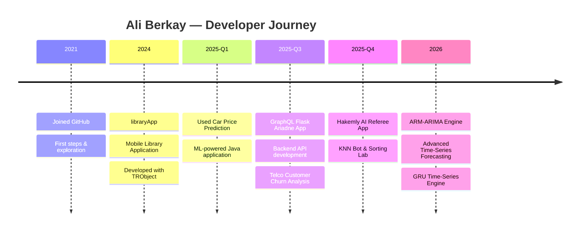

<div align="center">

<!-- Animated Header -->


<!-- Typing Animation -->
<a href="https://git.io/typing-svg">
  
</a>

<br/>

<!-- Social / Contact Badges -->
[](https://github.com/DemonstrativeAli)
[](https://github.com/DemonstrativeAli?tab=followers)
[](https://github.com/DemonstrativeAli)

</div>

---

## 🧑‍💻 About Me

```yaml
name: Ali Berkay
role: AI / ML Engineer & Data Scientist
location: Turkey 🇹🇷
education: Computer Engineering
interests:
  - Deep Learning & NLP
  - Time-Series Forecasting & Quant Modeling
  - Data Science & Analytics
  - Backend Architecture
currently_working_on: Hakemly, NexusParse AI projects
fun_fact: "I love turning complex data into mathematical art 🎨📊"
```

---

## 🛠️ Tech Stack & Tools

<div align="center">

### 💻 Languages


### 🤖 AI, ML & Data Science


### 🌐 Backend & Cloud


</div>

---

## 🚀 Featured Projects

<div align="center">

<!-- NEW PROJECTS -->
<a href="https://github.com/DemonstrativeAli/ARM_ARIMA_Time_Series_Engine_v2">
  
</a>
<a href="https://github.com/DemonstrativeAli/GRU_Time_Series_Engine_v2">
  
</a>

<!-- PREVIOUS PROJECTS -->
<a href="https://github.com/DemonstrativeAli/GraphQL_Flask_Ariadne-App">
  
</a>
<a href="https://github.com/DemonstrativeAli/Hakemly-AI-Referee-App-">
  
</a>
<a href="https://github.com/DemonstrativeAli/Used-Car-Price-Prediction-Java-Application">
  
</a>
<a href="https://github.com/DemonstrativeAli/Telco-Customer_Churn_Analysis">
  
</a>

</div>

---

## 📊 GitHub Stats

<div align="center">


<br/>

<!-- Streak Stats -->


</div>

---

## 🏆 GitHub Achievements

<div align="center">

<!-- Fixed parameters to ensure reliable rendering -->


</div>

---

## 📈 My Developer Journey



---

## 🐍 Contribution Snake

<div align="center">

<!-- Simplified generic dark/light endpoints to avoid 404s if output branch is broken -->
<picture>
  <source media="(prefers-color-scheme: dark)" srcset="https://raw.githubusercontent.com/DemonstrativeAli/DemonstrativeAli/output/github-contribution-grid-snake-dark.svg" />
  <source media="(prefers-color-scheme: light)" srcset="https://raw.githubusercontent.com/DemonstrativeAli/DemonstrativeAli/output/github-contribution-grid-snake.svg" />
  
</picture>

</div>

---

<div align="center">

### 💬 Get in Touch

*Feel free to reach out if you have questions about my projects or want to collaborate!*

<br/>

[](https://github.com/DemonstrativeAli)

<br/>


</div>
